# Animation previews

Every GIF is rendered from the exact keyframes in the `.rbxmx` files on a standard R6 rig (round head, classic face). No effects are drawn. Objects, walls and ledges are only there to show the motion; they are not part of the animation. Blue ticks on the timeline are markers. For large and huge objects the first panel hides the object so the body is readable.

Side-by-side comparisons with the reference videos are in [comparisons/](comparisons/).

Want something changed? Quote the animation name and what to change (e.g. *"MediumThrow: bigger knee lift, release later"*).

| Section | Animations |
|---|---|
| [Movement](#movement) | 23 |
| [Hit Reactions](#hit-reactions) | 2 |
| [Combat](#combat) | 10 |
| [Objects/Small](#objectssmall) | 11 |
| [Objects/Medium](#objectsmedium) | 11 |
| [Objects/Large](#objectslarge) | 11 |
| [Objects/Huge](#objectshuge) | 11 |

## Movement

Remakes of the moves in the two reference videos, plus jump / landing / ledge pieces in the same style.

### Idle

`Idle · 2.40s · looped`  
Relaxed breathing idle: arms hang a little away from the body (V1 38.5 s, V2 0.0 s).  

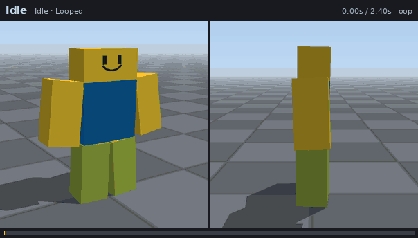

### Walk

`Movement · 1.00s · looped`  
Walk cycle matched to V2 (30-frame cycle): arms swing with a slight outward flare, small shoulder counter-twist. AdjustSpeed(speed / 16).  
Markers: `Footstep` 0.00s, `Footstep` 0.50s

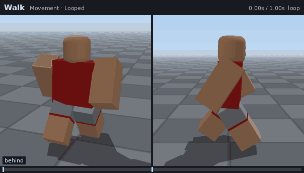

### Sprint

`Movement · 0.57s · looped`  
Ironpeak-style sprint: arms hold back/front and snap across, back arm flared wide, high back-kick (17-frame cycle). AdjustSpeed(speed / 26).  
Markers: `Footstep` 0.00s, `Footstep` 0.28s

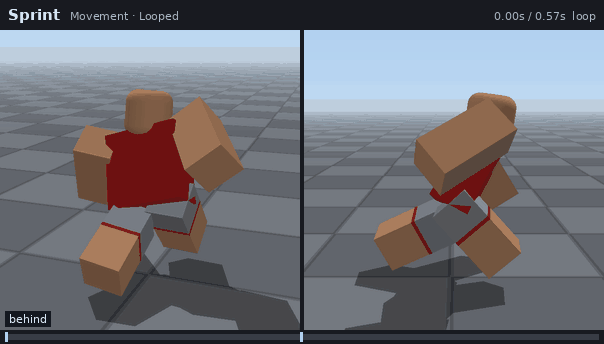

### CrouchIdle

`Movement · 2.00s · looped`  
Low crouch, one leg forward, arms hanging forward and out (V1 31.3 s).  

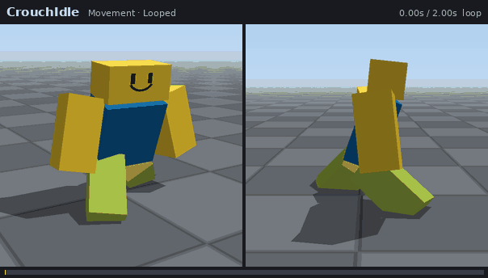

### CrouchWalk

`Movement · 1.00s · looped`  
Crouched sneak (V2 21.2 s, V1 27.5 s): low, legs splayed, arms hanging out to the sides and swaying (1.0 s cycle). AdjustSpeed(speed / 8).  
Markers: `Footstep` 0.00s, `Footstep` 0.50s

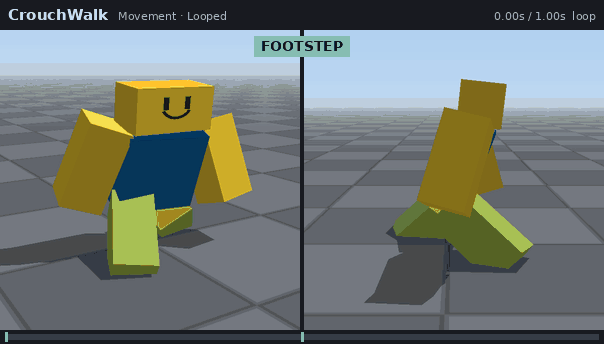

### Jump

`Movement · 0.40s`  
Take-off: dip, then the arms whip up and spread like wings while a knee drives up (V1 5.2 s). Holds into Fall.  
Markers: `Jump` 0.00s

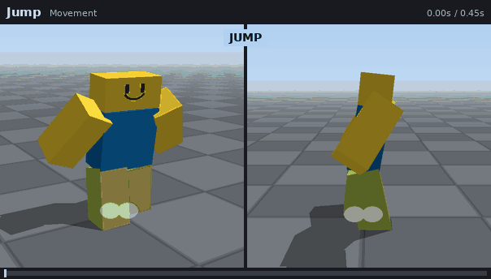

### Fall

`Movement · 0.90s · looped`  
Free-fall: arms straight out to the sides with a slow flap, legs paddling (V1 10.0 s).  

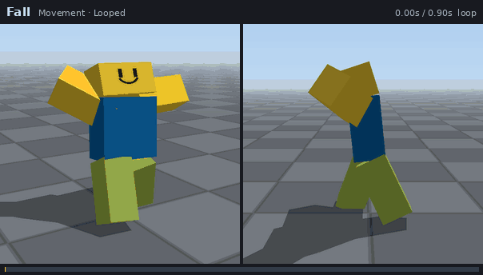

### Land

`Movement · 0.42s`  
Normal landing: quick knee-dip absorb, arms dropping from wings to balance.  
Markers: `Land` 0.05s

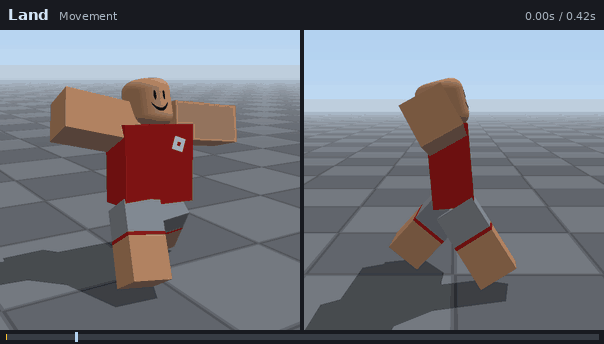

### LandHeavy

`Action · 1.00s`  
Superhero landing from a big drop: fist to the floor, wings arm out, then rise.  
Markers: `Impact` 0.07s

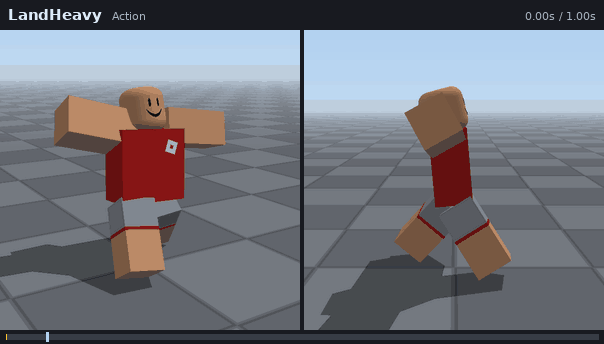

### LandRoll

`Action · 0.82s`  
Landing from a high fall straight into a forward roll, up into a run (V1 11.0 s).  
Markers: `Land` 0.05s, `Roll` 0.13s

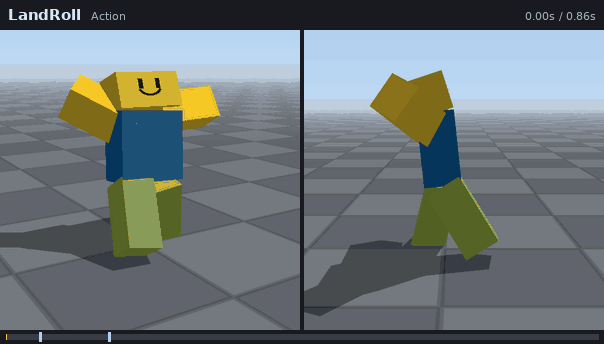

### Roll

`Action · 0.76s`  
Dodge roll from a run: dive, over the head with the arms spread wide, up running (V1 22.0 s, 52.0 s).  
Markers: `Roll` 0.12s, `Recover` 0.60s

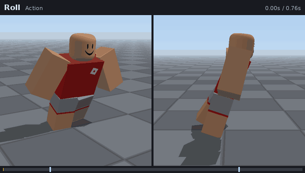

### SlideStart

`Action · 0.22s`  
Drop from a sprint into the slide (3 frames to the floor like the video). Chain into Slide.  
Markers: `Slide` 0.08s

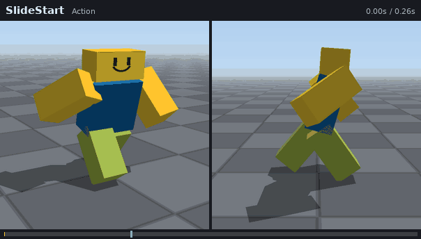

### Slide

`Movement · 0.60s · looped`  
Feet-first slide hold, arms spread out flat to the sides, small ground judder.  

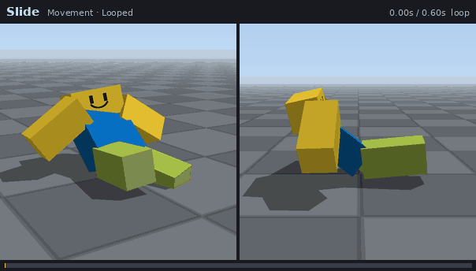

### SlideEnd

`Action · 0.40s`  
Pop back up out of the slide straight into a run (V1 0.9 s).  
Markers: `Stand` 0.12s

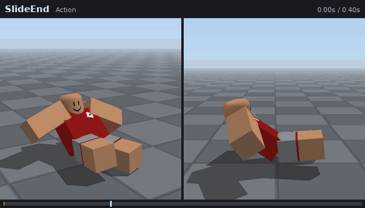

### LedgeHang

`Movement · 1.60s · looped`  
Hanging from a ledge by both hands, legs swaying.  

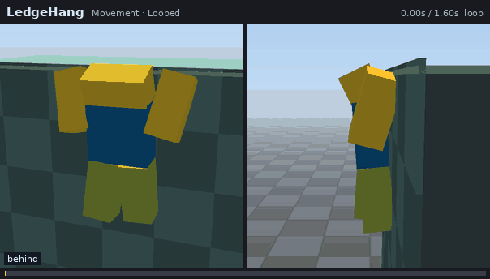

### LedgeClimb

`Action · 0.70s`  
Mantle over a ledge: pull, pitch forward over the edge with the arms flung wide, knees tucked, land running (V1 2.6 s, 14.1 s, 15.3 s). Move the root up/forward during 0.04-0.45 s.  
Markers: `Grab` 0.00s, `Push` 0.20s, `Land` 0.50s

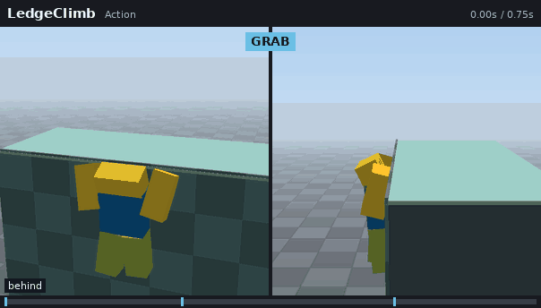

### WallClimb

`Movement · 0.48s · looped`  
Running straight up a wall: arms reach up and out in turn, knees drive (V1 2.2 s, 13.5 s).  
Markers: `Step` 0.00s, `Step` 0.24s

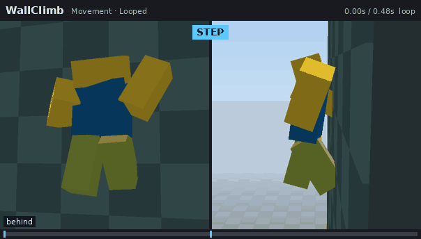

### WallRunRight

`Movement · 0.50s · looped`  
Wall run with the wall on the right: body tilts off the wall, both arms flared out and pumping, legs running (V1 4.8 s, 7.5 s).  
Markers: `Step` 0.00s, `Step` 0.25s

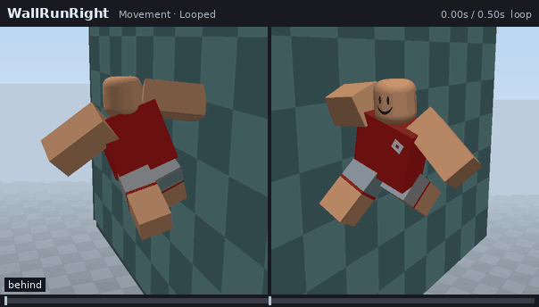

### WallRunLeft

`Movement · 0.50s · looped`  
Wall run with the wall on the left: body tilts off the wall, both arms flared out and pumping, legs running (V1 4.8 s, 7.5 s).  
Markers: `Step` 0.00s, `Step` 0.25s

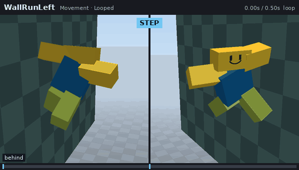

### WallRunEnterRight

`Action · 0.32s`  
Tucked spin onto the wall (right), straight into the wall run (V1 4.5 s and 7.05 s).  
Markers: `Attach` 0.22s

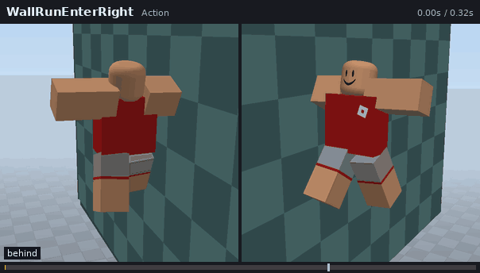

### WallRunEnterLeft

`Action · 0.32s`  
Tucked spin onto the wall (left), straight into the wall run (V1 4.5 s and 7.05 s).  
Markers: `Attach` 0.22s

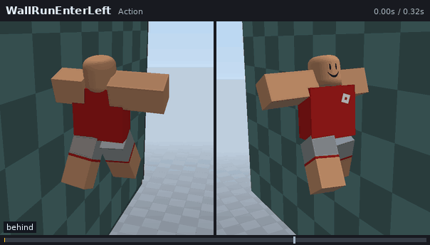

### WallJump

`Action · 0.50s`  
Tuck against the wall, kick off, arms flung out into the wings pose (V1 5.2 s).  
Markers: `Kick` 0.10s

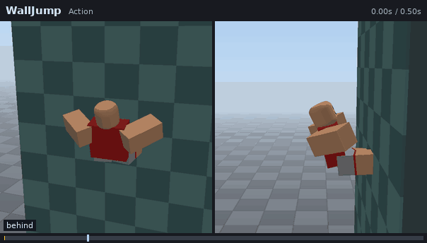

### Vault

`Action · 0.56s`  
Kong vault over a waist-high wall: dive, hands plant, knees tuck through, land running (V1 4.3 s, 6.9 s). Move the root up ~1.5 studs and forward while it plays.  
Markers: `Plant` 0.18s, `Land` 0.44s

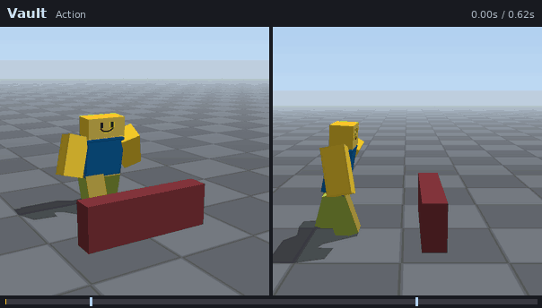

## Hit Reactions

Getting hit (the flinch from the video and a heavier knock-back).

### HitReact

`Action3 · 0.60s`  
Light hit flinch (V1 36.0 s, 38.0 s): head snaps back, arms jolt up in front, hold a beat, then lower.  
Markers: `Hit` 0.00s

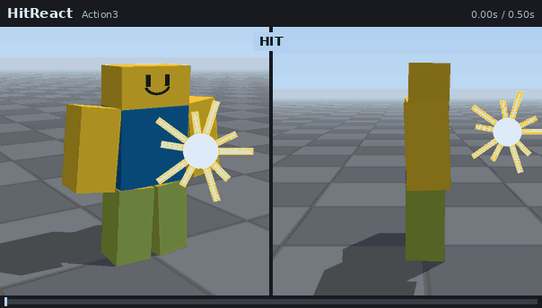

### HitHeavy

`Action3 · 0.90s`  
Heavy hit: knocked back with the arms flung out, stumbling steps, hunched recovery.  
Markers: `Hit` 0.00s, `Stumble` 0.26s

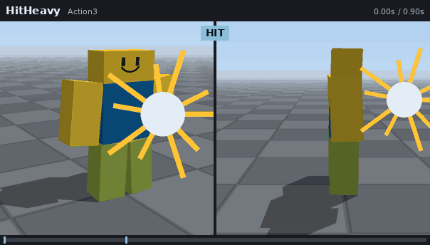

## Combat

Unarmed attacks. `_UB` = upper body only (plays on top of Walk/Sprint).

### Punch1

`Action2 · 0.36s`  
Combo hit 1: lead-hand jab, chest snaps round and the left shoulder drives forward.  
Markers: `Swing` 0.05s, `Hit` 0.11s

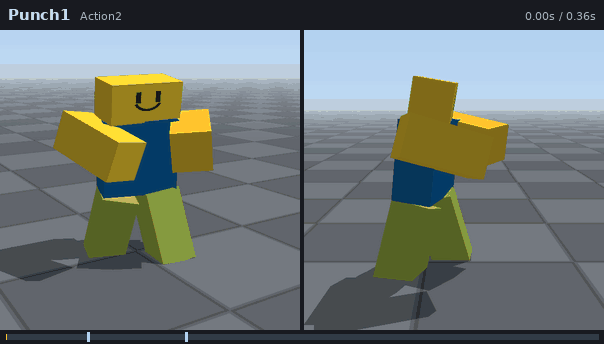

### Punch2

`Action2 · 0.42s`  
Combo hit 2: rear cross, full hip and chest turn, right shoulder rolls through.  
Markers: `Swing` 0.07s, `Hit` 0.15s

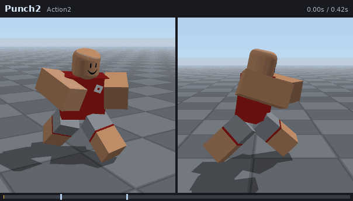

### Punch3

`Action2 · 0.46s`  
Combo hit 3: wide lead hook, chest coils back then whips through.  
Markers: `Swing` 0.08s, `Hit` 0.16s

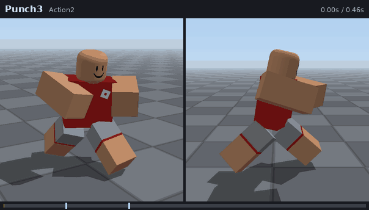

### Punch4

`Action2 · 0.62s`  
Combo finisher: dip with the chest rolled over the right hip, then a rising uppercut that rolls the body the other way (launcher).  
Markers: `Swing` 0.13s, `Hit` 0.22s

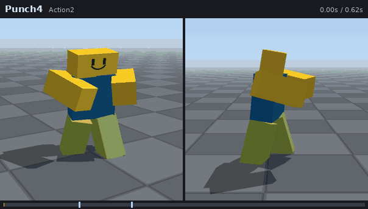

### Kick

`Action2 · 0.72s`  
Roundhouse kick: chest leans well away from the kicking leg and turns through.  
Markers: `Swing` 0.13s, `Hit` 0.26s

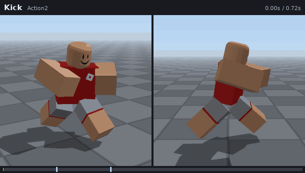

### HeavyPunch

`Action2 · 1.00s`  
Charged heavy punch: chest coils right and rolls back, lunging step, the whole body rolls into a long follow-through.  
Markers: `Charge` 0.05s, `Swing` 0.38s, `Hit` 0.48s

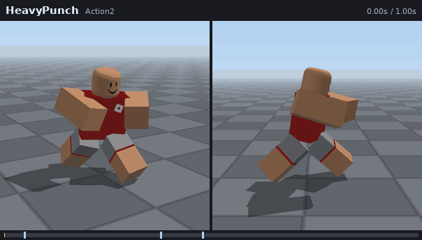

### PunchBlocked

`Action3 · 0.55s`  
Your punch/kick hits a block: fist knocked back, chest twisted open, recoil half-step, guard back up.  
Markers: `Blocked` 0.00s

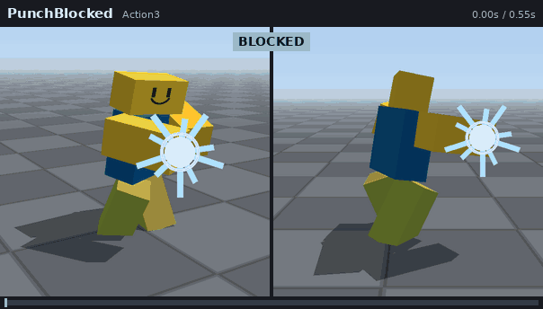

### Punch1_UB

`Action2 · 0.36s · joints: Neck, Right Shoulder, Left Shoulder`  
Upper-body-only version of Punch1: plays on top of Walk/Sprint (legs keep running).  
Markers: `Swing` 0.05s, `Hit` 0.11s

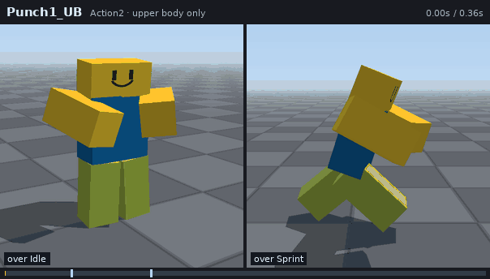

### Punch2_UB

`Action2 · 0.42s · joints: Neck, Right Shoulder, Left Shoulder`  
Upper-body-only version of Punch2: plays on top of Walk/Sprint (legs keep running).  
Markers: `Swing` 0.07s, `Hit` 0.15s

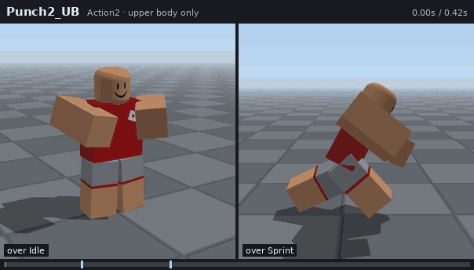

### Punch3_UB

`Action2 · 0.46s · joints: Neck, Right Shoulder, Left Shoulder`  
Upper-body-only version of Punch3: plays on top of Walk/Sprint (legs keep running).  
Markers: `Swing` 0.08s, `Hit` 0.16s

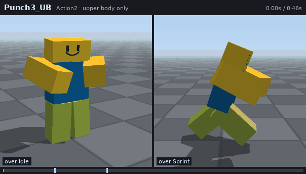

## Objects/Small

Rocks, cans, bricks... **one hand, light and quick.**

### SmallPickup

`Action2 · 0.55s`  
Quick one-hand scoop: dip and reach with the right shoulder rolled down.  
Markers: `Grab` 0.22s

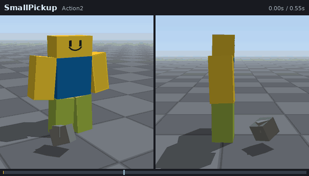

### SmallHold

`Action · 1.60s · looped · joints: Right Shoulder`  
Carry a small object in the right hand. Only the right arm is animated, so the other arm keeps swinging with Walk/Sprint.  

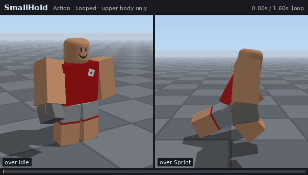

### SmallThrow

`Action2 · 0.50s`  
Light one-hand flick throw: chest opens right, then snaps round with the right shoulder rolling through.  
Markers: `Windup` 0.02s, `Release` 0.20s

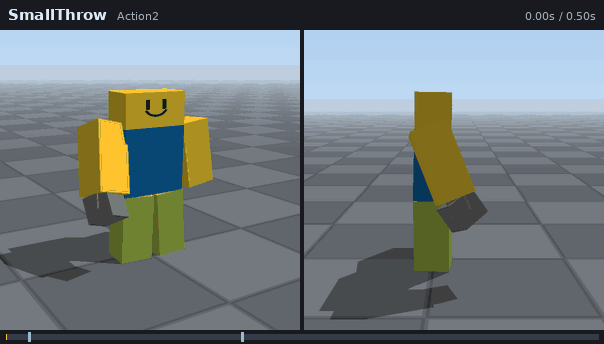

### SmallThrow_UB

`Action2 · 0.50s · joints: Neck, Right Shoulder, Left Shoulder`  
Light one-hand flick throw: chest opens right, then snaps round with the right shoulder rolling through. Upper-body only: plays over Walk/Sprint, legs keep running.  
Markers: `Windup` 0.02s, `Release` 0.20s

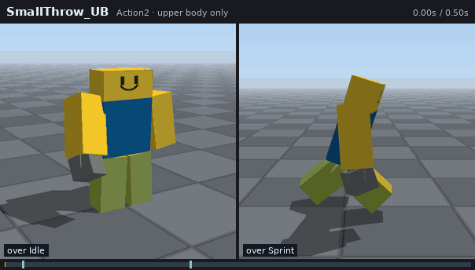

### SmallSwing

`Action2 · 0.45s`  
Fast overhand smack: arm cocks up behind the head, chest whips down and round.  
Markers: `Swing` 0.10s, `Hit` 0.18s

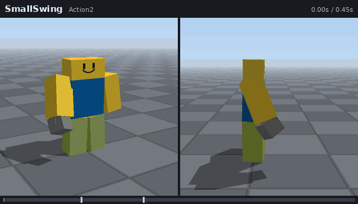

### SmallSwing_UB

`Action2 · 0.45s · joints: Neck, Right Shoulder, Left Shoulder`  
Fast overhand smack: arm cocks up behind the head, chest whips down and round. Upper-body only: plays over Walk/Sprint, legs keep running.  
Markers: `Swing` 0.10s, `Hit` 0.18s

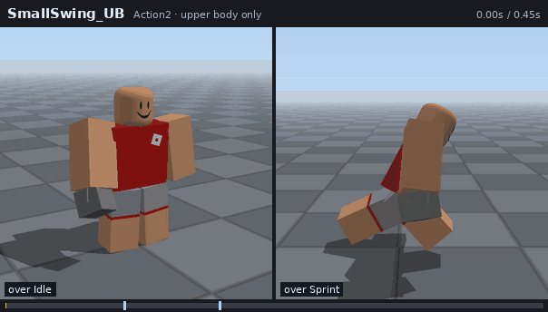

### SmallSwingBlocked

`Action3 · 0.50s`  
Small-object hit bounces off a block: arm knocked up and back, chest twisted open, half-step back.  
Markers: `Blocked` 0.00s

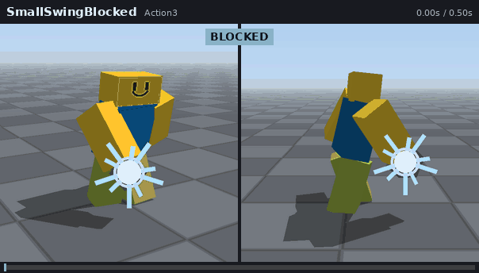

### SmallBlock

`Action2 · 4.00s`  
Forearm guard with the small object up by the face, chest turned side-on. Solid for ~1.8 s, gives twice, shakes, then buckles at 4 s (AdjustSpeed(4 / seconds) for 3-5 s).  
Markers: `Raised` 0.10s, `Weakening` 1.85s, `Critical` 3.00s, `Exhausted` 3.95s

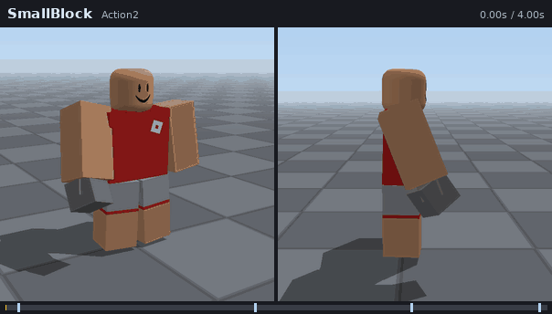

### SmallBlock_UB

`Action2 · 4.00s · joints: Neck, Right Shoulder, Left Shoulder`  
Forearm guard with the small object up by the face, chest turned side-on. Solid for ~1.8 s, gives twice, shakes, then buckles at 4 s (AdjustSpeed(4 / seconds) for 3-5 s). Upper-body only: plays over Walk/Sprint.  
Markers: `Raised` 0.10s, `Weakening` 1.85s, `Critical` 3.00s, `Exhausted` 3.95s

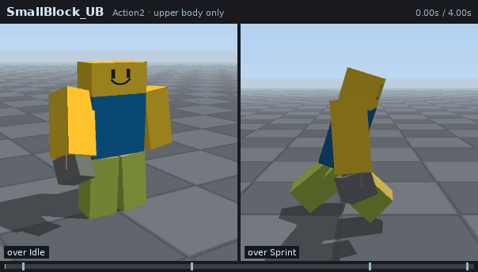

### SmallBlockBreak

`Action3 · 0.72s`  
Guard knocked wide open, chest flung back and twisted, stumble back.  
Markers: `Break` 0.03s

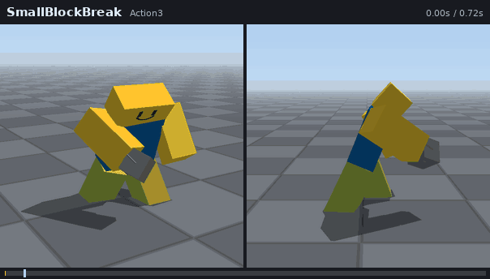

### SmallBlockHit

`Action3 · 0.40s`  
Small block takes a hit: guard and chest knocked back and twisted, feet slide, then re-set. Play over SmallBlock (starts and ends in the block pose).  
Markers: `Impact` 0.00s

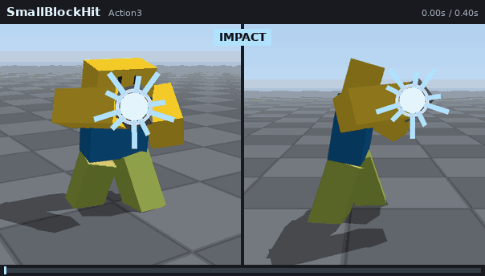

## Objects/Medium

Crates, barrels, chairs... **one hand, big dramatic wind-ups.**

### MediumPickup

`Action2 · 0.80s`  
Bend with the right shoulder dropped, grab one-handed and swing it up overhead.  
Markers: `Grab` 0.30s

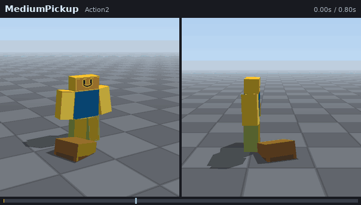

### MediumHold

`Action · 1.60s · looped · joints: Right Shoulder`  
Carry a medium object raised one-handed over the shoulder. Only the right arm is animated, so the other arm keeps the Walk/Sprint swing.  

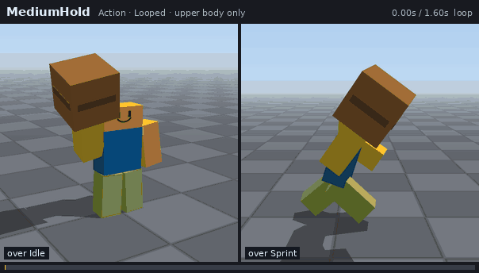

### MediumThrow

`Action2 · 0.86s`  
Pitcher-style one-hand throw: chest coils away and arches back over a knee lift, then whips round and crunches down through the release.  
Markers: `Windup` 0.05s, `Release` 0.46s

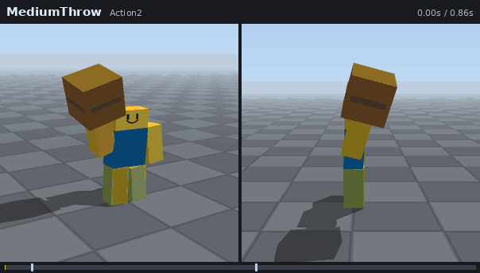

### MediumThrow_UB

`Action2 · 0.86s · joints: Neck, Right Shoulder, Left Shoulder`  
Pitcher-style one-hand throw: chest coils away and arches back over a knee lift, then whips round and crunches down through the release. Upper-body only: plays over Walk/Sprint, legs keep running.  
Markers: `Windup` 0.05s, `Release` 0.46s

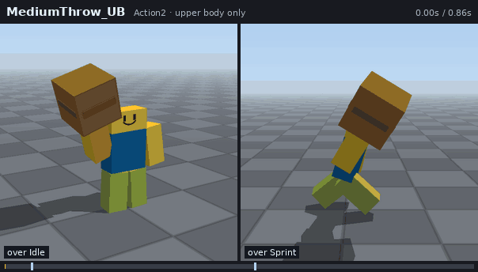

### MediumSwing

`Action2 · 0.80s`  
One-handed overhead smash: rise and lean back with the chest open, then crash down with the body rolled over the swinging arm.  
Markers: `Swing` 0.27s, `Hit` 0.36s

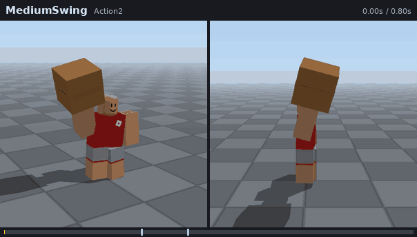

### MediumSwing_UB

`Action2 · 0.80s · joints: Neck, Right Shoulder, Left Shoulder`  
One-handed overhead smash: rise and lean back with the chest open, then crash down with the body rolled over the swinging arm. Upper-body only: plays over Walk/Sprint, legs keep running.  
Markers: `Swing` 0.27s, `Hit` 0.36s

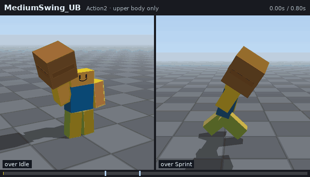

### MediumSwingBlocked

`Action3 · 0.66s`  
Medium smash slams into a block and rebounds overhead; chest thrown back and open, stagger.  
Markers: `Blocked` 0.00s

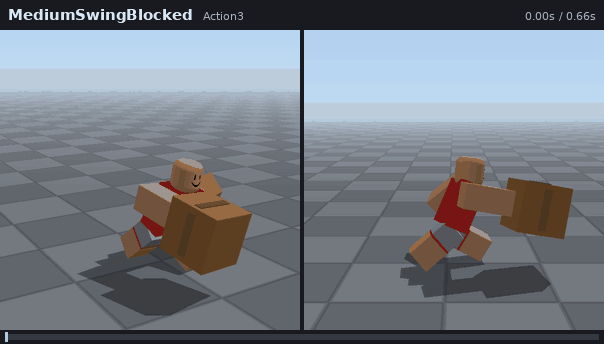

### MediumBlock

`Action2 · 4.00s`  
Object held out front as a shield with the off hand bracing, chest turned behind it. Solid for ~1.8 s, gives twice, shakes, then buckles at 4 s (AdjustSpeed(4 / seconds) for 3-5 s).  
Markers: `Raised` 0.10s, `Weakening` 1.85s, `Critical` 3.00s, `Exhausted` 3.95s

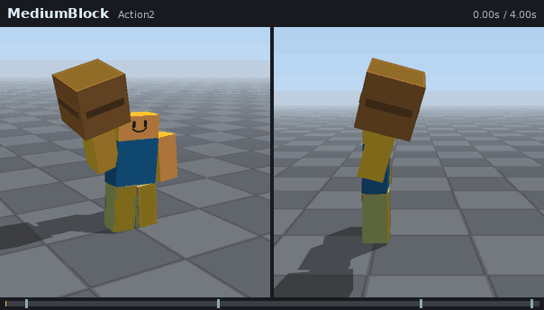

### MediumBlock_UB

`Action2 · 4.00s · joints: Neck, Right Shoulder, Left Shoulder`  
Object held out front as a shield with the off hand bracing, chest turned behind it. Solid for ~1.8 s, gives twice, shakes, then buckles at 4 s (AdjustSpeed(4 / seconds) for 3-5 s). Upper-body only: plays over Walk/Sprint.  
Markers: `Raised` 0.10s, `Weakening` 1.85s, `Critical` 3.00s, `Exhausted` 3.95s

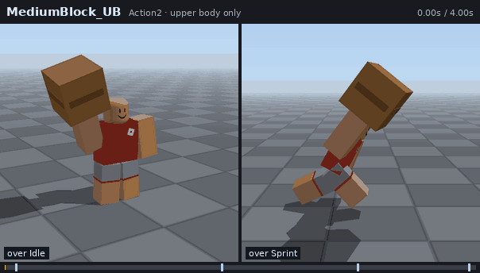

### MediumBlockBreak

`Action3 · 0.86s`  
Shield-object knocked up and away, chest flung open, big stumble back.  
Markers: `Break` 0.03s

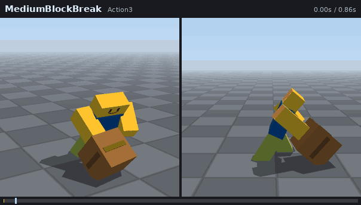

### MediumBlockHit

`Action3 · 0.50s`  
Medium block takes a hit: guard and chest knocked back and twisted, feet slide, then re-set. Play over MediumBlock (starts and ends in the block pose).  
Markers: `Impact` 0.00s

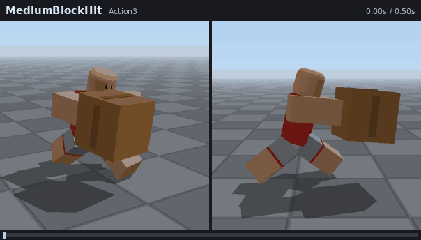

## Objects/Large

Cars, boulders, dumpsters... **two hands, heavy impacts.**

### LargePickup

`Action2 · 1.10s`  
Deep squat, grip underneath, a strained beat, then an explosive two-hand lift that arches the chest back under it.  
Markers: `Grab` 0.40s, `Settle` 0.86s

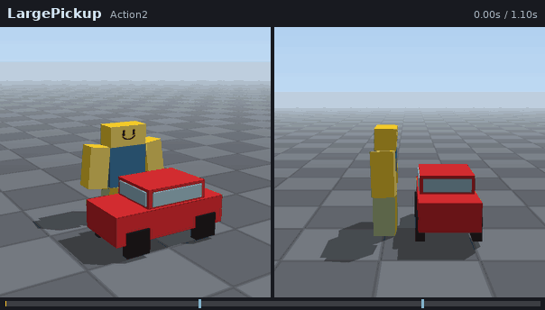

### LargeHold

`Action · 2.00s · looped · joints: Right Shoulder, Left Shoulder`  
Large object held overhead with both arms, a slow straining sway. Arms only, so the legs and torso come from Idle/Walk/Sprint.  

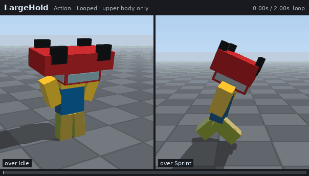

### LargeThrow

`Action2 · 1.10s`  
Two-hand overhead heave: arch way back, step in, launch, and fold the chest down through a long follow-through.  
Markers: `Windup` 0.05s, `Release` 0.55s

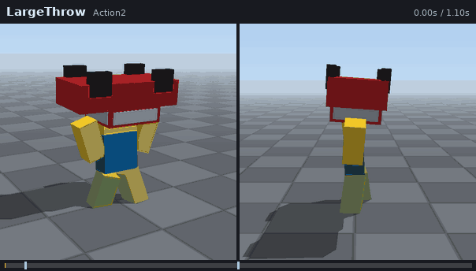

### LargeThrow_UB

`Action2 · 1.10s · joints: Neck, Right Shoulder, Left Shoulder`  
Two-hand overhead heave: arch way back, step in, launch, and fold the chest down through a long follow-through. Upper-body only: plays over Walk/Sprint, legs keep running.  
Markers: `Windup` 0.05s, `Release` 0.55s

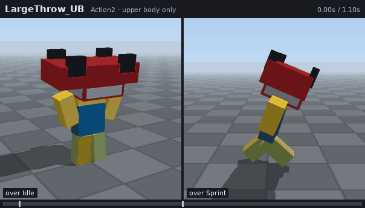

### LargeSwing

`Action2 · 1.00s`  
Two-handed overhead slam: rise up on the toes and arch back, then crash it into the ground with the chest folded over it.  
Markers: `Swing` 0.36s, `Hit` 0.50s

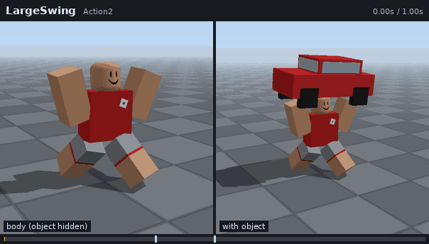

### LargeSwing_UB

`Action2 · 1.00s · joints: Neck, Right Shoulder, Left Shoulder`  
Two-handed overhead slam: rise up on the toes and arch back, then crash it into the ground with the chest folded over it. Upper-body only: plays over Walk/Sprint, legs keep running.  
Markers: `Swing` 0.36s, `Hit` 0.50s

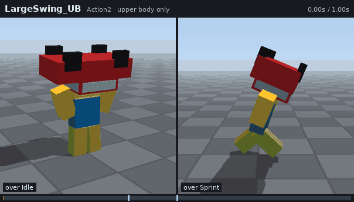

### LargeSwingBlocked

`Action3 · 0.90s`  
Slam stopped by a block: object bounces back overhead, chest thrown back and tilted, heavy stagger.  
Markers: `Blocked` 0.00s

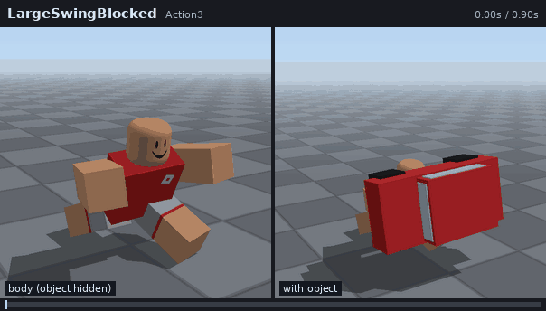

### LargeBlock

`Action2 · 4.00s`  
Object braced in front as a wall with both arms, chest leaning into it. Solid for ~1.8 s, gives twice, shakes, then buckles at 4 s (AdjustSpeed(4 / seconds) for 3-5 s).  
Markers: `Raised` 0.10s, `Weakening` 1.85s, `Critical` 3.00s, `Exhausted` 3.95s

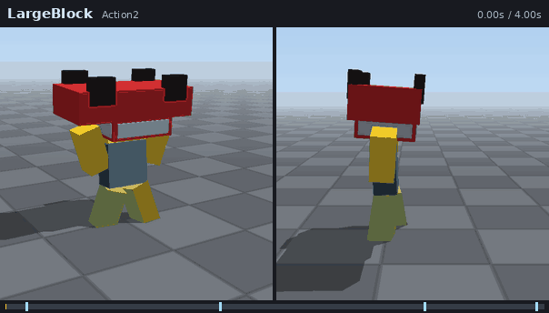

### LargeBlock_UB

`Action2 · 4.00s · joints: Neck, Right Shoulder, Left Shoulder`  
Object braced in front as a wall with both arms, chest leaning into it. Solid for ~1.8 s, gives twice, shakes, then buckles at 4 s (AdjustSpeed(4 / seconds) for 3-5 s). Upper-body only: plays over Walk/Sprint.  
Markers: `Raised` 0.10s, `Weakening` 1.85s, `Critical` 3.00s, `Exhausted` 3.95s

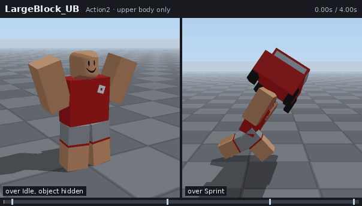

### LargeBlockBreak

`Action3 · 1.10s`  
The weight crushes the guard: buckle down to a knee with the chest twisted under it, shake, then heave it back up.  
Markers: `Break` 0.04s

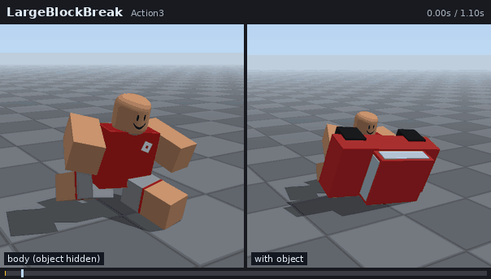

### LargeBlockHit

`Action3 · 0.60s`  
Large block takes a hit: guard and chest knocked back and twisted, feet slide, then re-set. Play over LargeBlock (starts and ends in the block pose).  
Markers: `Impact` 0.00s

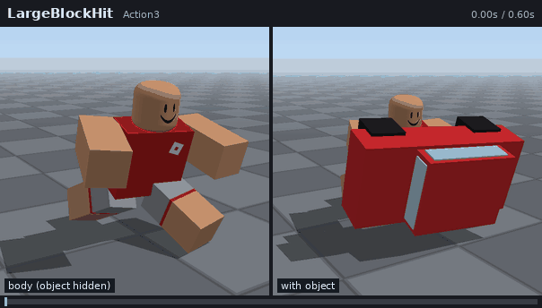

## Objects/Huge

Trains, planes, buses (2-3x your height)... **titan-sized two-hand moves.**

### HugePickup

`Action2 · 1.50s`  
Titan lift: squat under it, strain with the chest rocking, then explode it up overhead.  
Markers: `Grab` 0.44s, `Lift` 0.84s, `Settle` 1.26s

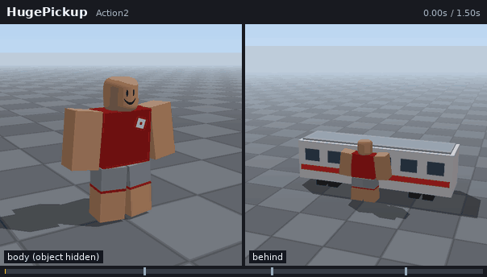

### HugeHold

`Action · 2.40s · looped · joints: Right Shoulder, Left Shoulder`  
Train/plane balanced overhead, arms wide, slow heavy see-saw wobble. Arms only.  

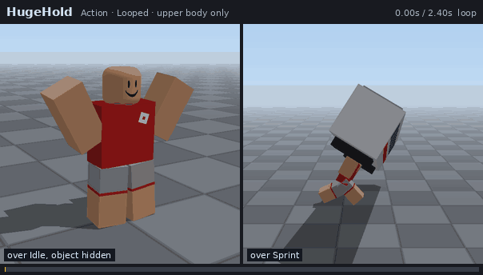

### HugeThrow

`Action2 · 1.60s`  
Deep dip, a huge arch back, then a full-body launch with the chest folding down after it.  
Markers: `Windup` 0.05s, `Release` 0.72s

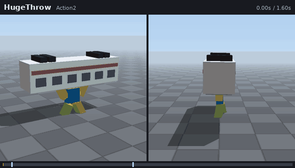

### HugeThrow_UB

`Action2 · 1.60s · joints: Neck, Right Shoulder, Left Shoulder`  
Deep dip, a huge arch back, then a full-body launch with the chest folding down after it. Upper-body only: plays over Walk/Sprint, legs keep running.  
Markers: `Windup` 0.05s, `Release` 0.72s

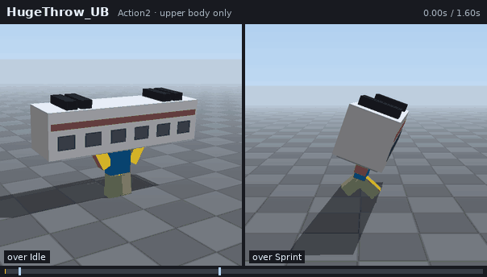

### HugeSwing

`Action2 · 1.60s`  
Bring it down to chest height, coil the chest right, then sweep it through a wide horizontal arc like a giant plank, rolling the body over the follow-through.  
Markers: `Swing` 0.46s, `Hit` 0.64s

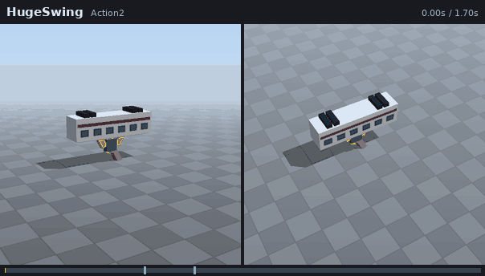

### HugeSwing_UB

`Action2 · 1.60s · joints: Neck, Right Shoulder, Left Shoulder`  
Bring it down to chest height, coil the chest right, then sweep it through a wide horizontal arc like a giant plank, rolling the body over the follow-through. Upper-body only: plays over Walk/Sprint, legs keep running.  
Markers: `Swing` 0.46s, `Hit` 0.64s

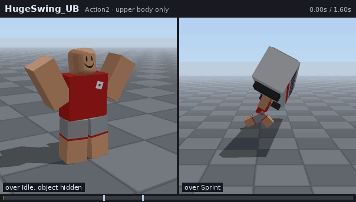

### HugeSwingBlocked

`Action3 · 1.10s`  
The sweep is stopped dead by a block; the recoil twists the chest back the other way and you stagger.  
Markers: `Blocked` 0.00s

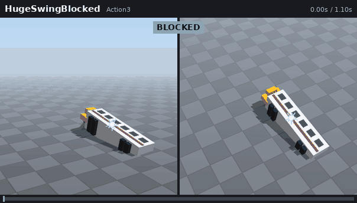

### HugeBlock

`Action2 · 4.00s`  
Vehicle held up in front like a wall, legs wide, chest driven into it. Solid for ~1.8 s, gives twice, shakes, then buckles at 4 s (AdjustSpeed(4 / seconds) for 3-5 s).  
Markers: `Raised` 0.10s, `Weakening` 1.85s, `Critical` 3.00s, `Exhausted` 3.95s

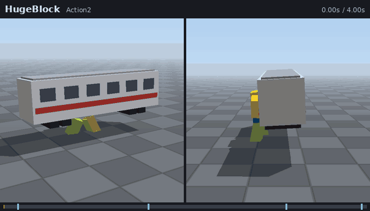

### HugeBlock_UB

`Action2 · 4.00s · joints: Neck, Right Shoulder, Left Shoulder`  
Vehicle held up in front like a wall, legs wide, chest driven into it. Solid for ~1.8 s, gives twice, shakes, then buckles at 4 s (AdjustSpeed(4 / seconds) for 3-5 s). Upper-body only: plays over Walk/Sprint.  
Markers: `Raised` 0.10s, `Weakening` 1.85s, `Critical` 3.00s, `Exhausted` 3.95s

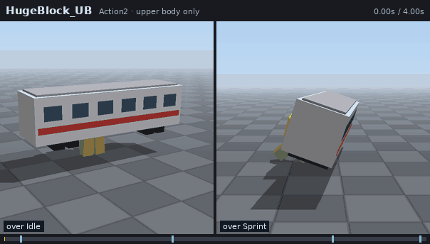

### HugeBlockBreak

`Action3 · 1.40s`  
Crushed under the weight: driven down low with the chest twisted, shaking, then a last-second heave back up.  
Markers: `Break` 0.05s

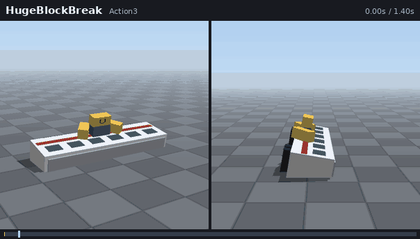

### HugeBlockHit

`Action3 · 0.75s`  
Huge block takes a hit: guard and chest knocked back and twisted, feet slide, then re-set. Play over HugeBlock (starts and ends in the block pose).  
Markers: `Impact` 0.00s

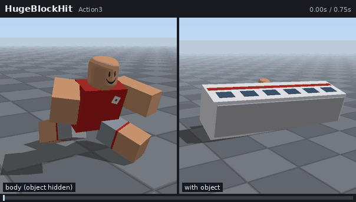
